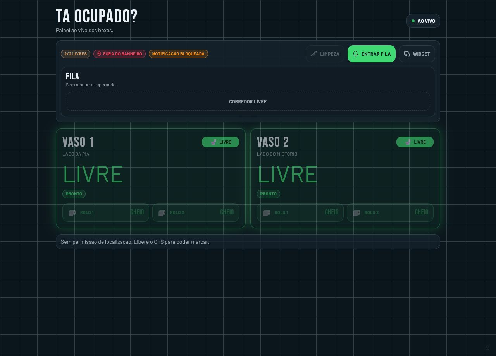

# Tá Ocupado?

Painel em tempo real para saber se os boxes do banheiro estão livres, ocupados,
em limpeza ou sem papel. O app também tem fila anônima, emotes em tempo real,
modo PWA e um painel ADM escondido para manutenção.



## O que o app faz

- Mostra o status de dois vasos em tempo real.
- Permite marcar vaso como livre/ocupado dentro do perímetro do banheiro.
- Controla papel higiênico por rolo, incluindo estado de rolo acabado.
- Exibe modo limpeza com layout separado e boxes ocultos.
- Mantém uma fila anônima para quem está esperando.
- Permite enviar stickers/emotes na fila em tempo real.
- Dispara notificações do navegador quando os avisos estão permitidos.
- Inclui painel ADM oculto para limpeza, fila, perímetro e testes de aviso.

## Stack

- React 19
- TanStack Start / Router
- TypeScript
- Tailwind CSS
- Supabase Realtime
- Cloudflare Workers
- PWA com service worker e manifest
- Capacitor para app nativo Android/iOS

## Como rodar localmente

Requisitos:

- Node.js 22+
- npm
- variáveis de ambiente do Supabase em `.env`

```sh
npm install
npm run dev
```

O app local normalmente abre em:

```sh
http://127.0.0.1:8080/
```

## Variáveis de ambiente

Use `.env.example` como base:

```sh
VITE_SUPABASE_URL=
VITE_SUPABASE_PUBLISHABLE_KEY=
VITE_SUPABASE_PROJECT_ID=
```

## Banco de dados

O projeto usa Supabase nas tabelas:

- `stalls`
- `bathroom_state`
- `queue_tickets`

As migrations ficam em `supabase/migrations`.

O perímetro padrão do banheiro está fixado em:

```txt
lat: -27.124368
lng: -48.604723
raio: 5m
```

## Scripts

```sh
npm run dev
npm run build
npm run lint
npm run preview:cloudflare
npm run deploy:cloudflare
npm run cap:sync
npm run cap:android
npm run cap:ios
```

## Deploy

O deploy atual usa Cloudflare Workers via Wrangler:

```sh
npm run deploy:cloudflare
```

URL publicada:

```txt
https://taocupado.taocupado.workers.dev
```

## App nativo

O projeto usa Capacitor para empacotar a mesma experiência web em app nativo.
O app nativo abre o Worker publicado em:

```txt
https://taocupado.taocupado.workers.dev
```

Comandos principais:

```sh
npm run cap:sync
npm run cap:android
npm run cap:ios
```

No Android, o app mostra um botão **Acompanhar** quando está rodando dentro do
Capacitor. Esse botão fixa uma notificação nativa com o status dos vasos e
atualiza o conteúdo conforme o Supabase Realtime muda.

No iOS, a base Capacitor já está configurada, mas o painel fixo estilo placar
precisa de uma implementação nativa com ActivityKit/Live Activities em Xcode.
Esse passo precisa de macOS.

Para compilar Android localmente, use JDK 17 ou 21. JDKs muito novos podem
falhar no Gradle com erro de `Unsupported class file major version`.

## Notificações

O app usa notificações reais do navegador com `Notification` e
`ServiceWorkerRegistration.showNotification()`.

O fluxo esperado é:

1. O usuário toca em **Ativar aviso** ou entra na fila.
2. O navegador pede permissão.
3. O app envia uma notificação de confirmação.
4. Quando chegar a vez da pessoa, outra notificação é disparada.

Observação importante: para notificar com o app totalmente fechado no celular,
o próximo passo seria implementar Push API com assinatura por dispositivo e um
backend enviando push. O fluxo atual cobre notificação real enquanto o app/PWA
está aberto ou vivo em background.

## ADM

O app tem um painel ADM discreto para:

- alternar modo limpeza;
- marcar/desmarcar boxes sem bloqueio;
- remover pessoas da fila;
- ajustar perímetro;
- testar notificações;
- minimizar sem sair da sessão ADM.

## Validação

Antes de publicar, rode:

```sh
npm run lint
npm run build
```

Atualmente o lint pode exibir warnings de Fast Refresh em componentes `ui`,
mas não deve retornar erros.
